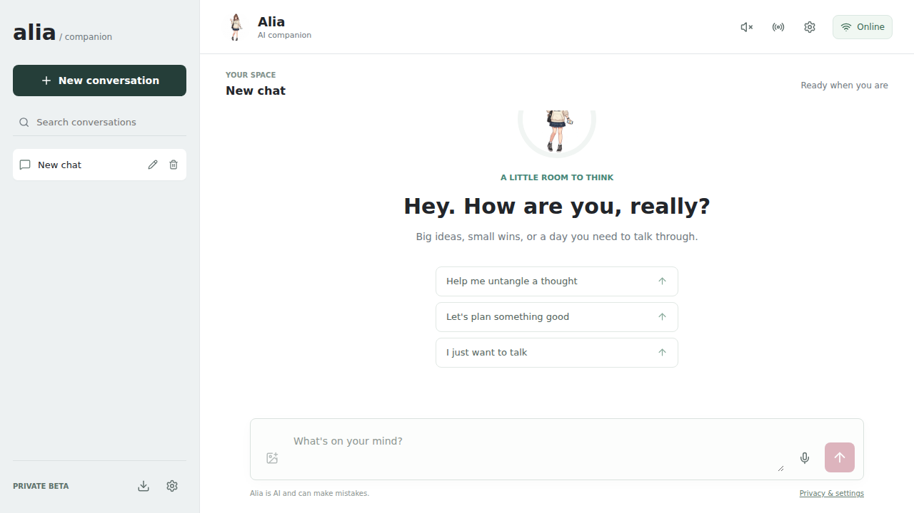
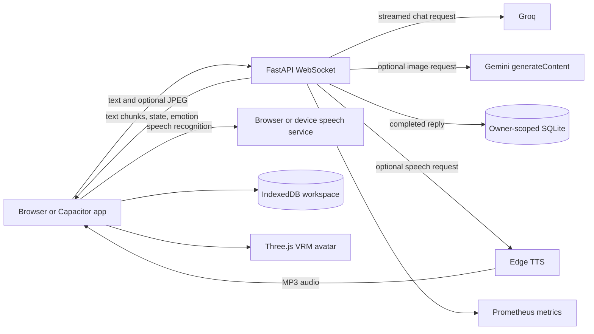

# Alia AI Companion

Alia is a private-beta multimodal companion with streamed text chat, optional image
understanding, voice interaction, and a responsive VRM avatar. The repository describes
the implementation that actually runs: it does not claim Whisper, MongoDB, or retrieval-
augmented generation.

## What is implemented

- WebSocket chat with streamed Groq responses, interruption, bounded messages, retries,
  and duplicate-request protection.
- Optional Gemini image description for uploaded photos and live camera frames.
- Browser Web Speech or Capacitor speech recognition and Edge TTS voice replies.
- Explicit listening, thinking, replying, speaking, interrupted, and offline states.
- Lazy-loaded Three.js/React Three Fiber VRM avatar with procedural mouth movement and
  reply-driven expression selection.
- IndexedDB workspace persistence in the browser and owner-scoped SQLite history on the
  server.
- Conversation search, rename, export, retry, stop, and server-confirmed deletion.
- Configurable server-side retention, provider latency metrics, health checks, and
  privacy disclosures.
- Unit, WebSocket integration, frontend component, Playwright, lint, build, and
  container tests in GitHub Actions.

## Verified interface



The screenshot is generated by the Playwright test against the real frontend and API
containers. Provider keys are not required to verify startup, authentication, storage,
privacy controls, or WebSocket connectivity.

## Architecture and data flow



Images are normalized to JPEG in the client. Gemini receives image bytes only when
image understanding is configured and the user sends an image. The server stores the
resulting text description as part of a completed turn, not the image bytes. Groq
receives the system instruction, up to ten recent messages, and the current prompt.
Edge TTS receives completed reply text only when voice output is requested.

## Technology

- Frontend: React 19, Vite, IndexedDB, React Three Fiber, Three.js, VRM, Capacitor.
- API: FastAPI, Pydantic, WebSockets, SQLite WAL mode.
- Providers: Groq chat, optional Gemini image understanding, Edge TTS, browser/device
  speech recognition.
- Operations: Docker Compose, Caddy, Prometheus client metrics, GitHub Actions,
  Playwright, Vitest, Oxlint, Ruff.

## One-command local setup

Requirements: Docker with Compose v2 and approximately 2 GB of available memory.

```bash
cp .env.example .env
# Add GROQ_API_KEY to enable replies. Gemini settings are optional.
docker compose up --build -d
```

Open <http://localhost:5173>. API health and metrics are available at
<http://localhost:8000/health> and <http://localhost:8000/metrics>.

```bash
docker compose down
```

The application still starts without provider keys, allowing the UI, privacy controls,
storage, health, and WebSocket handshake to be tested without spending provider credits.

## Managed HTTPS interview demo

The repository includes a Render Blueprint and a single-service Docker image that serves
the compiled React application and FastAPI/WebSocket API from the same HTTPS origin.
Render's free web-service plan is suitable for an interview demonstration and requires
no always-on instance.

[**Open the live HTTPS demo**](https://alia-ai-companion.onrender.com) — invited viewers
need the private beta access code. The service may take about a minute to wake after it
has been idle.

[](https://render.com/deploy?repo=https://github.com/Nitin31804/alia-ai-companion)

During Blueprint creation, enter `GROQ_API_KEY` and a random
`BETA_ACCESS_TOKEN` containing at least 32 characters. The access token is entered by
invited viewers in Settings; it is never compiled into the frontend. The service uses
Render's generated HTTPS URL as its allowed WebSocket origin.

This free demo deliberately stores SQLite data on ephemeral storage. Conversations can
disappear after a restart, redeploy, or idle shutdown. That is acceptable for a
controlled interview demo, not for production or durable user accounts. The full
production checklist remains in [RELEASE.md](RELEASE.md).

## Manual development

Use Python 3.12 and Node 22:

```bash
python -m venv .venv
# Windows: .venv\Scripts\activate
# macOS/Linux: source .venv/bin/activate
pip install -r backend/requirements-dev.txt
cp backend/.env.example backend/.env
# Add GROQ_API_KEY to backend/.env for real chat replies.
python -m uvicorn main:app --app-dir backend --host 127.0.0.1 --port 8001
```

In another terminal:

```bash
cd frontend
npm ci
npm run dev -- --host 127.0.0.1
```

## Conversation history—not RAG

The API supplies the latest ten stored messages for continuity. Completed turns are
scoped to a SHA-256 digest of a random browser secret and duplicate request IDs return
the saved response. `ALIA_RETENTION_DAYS` defaults to 30; set it to a value from 1 to
3650, or deliberately use `0` for indefinite retention.

This is short conversation history, not semantic retrieval or RAG. There are no
embeddings, vector database, or claims of long-term relevance-ranked memory.

## Verification

```bash
python -m unittest discover -s backend -p "test_*.py" -v
ruff check backend
cd frontend
npm ci
npm run lint
npm run test:unit
npm run build
npm run test:e2e  # requires the Compose stack and Playwright Chromium
```

The tests cover health and metrics contracts, provider failures, cancellation,
idempotent retries, owner isolation, deletion, access/origin checks, limits, retention,
frontend startup, WebSocket authentication, privacy controls, lint, production builds,
and the real container boundary.

## Metrics

`/metrics` exports low-cardinality Prometheus measurements for active WebSocket
connections, terminal chat outcomes, idempotent retry hits, provider errors, client-
reported speech recognition time, LLM first-token and total response time, image
processing time, and TTS generation time. No message text, identity secret, access code,
or image data is used as a metric label. See [docs/METRICS.md](docs/METRICS.md) for the
controlled measurement procedure and reporting rules.

## Security and privacy boundaries

- Production startup requires a 32-character beta token, a Groq key, and explicit HTTPS
  origins.
- Client secrets are random browser identities; they are hashed before server storage.
- Access codes remain in page memory and are never placed in `VITE_*` variables.
- Failed and cancelled generations are not persisted; completed requests are idempotent.
- Conversation deletion removes the selected browser identity's local and active-server
  copy. Provider retention and operator backups remain separate responsibilities.
- Image descriptions are treated as untrusted user content in the model prompt.

## Limitations

- This is a single-worker private beta, not an open multi-user service.
- SQLite, in-process rate limits, and active-turn locks do not support horizontal scaling.
  A scaled version would require PostgreSQL, shared limits/state such as Redis, and real
  account authentication.
- The free Render interview deployment uses ephemeral SQLite storage and can take about
  a minute to wake after being idle; it is demonstration infrastructure, not production.
- Browser/device speech recognition availability and privacy behavior vary by platform.
- Avatar emotion uses a documented keyword heuristic, and lip movement is procedural
  rather than phoneme- or amplitude-driven.
- Recent-message history is not RAG and has no semantic retrieval evaluation.
- Provider calls incur external latency, retention, availability, and cost considerations.
- Bundled visual assets must be license-checked before public distribution.

## Repository layout

```text
backend/                 FastAPI WebSocket API, providers, storage, metrics, tests
frontend/src/            React workspace, voice mode, VRM avatar, unit tests
frontend/e2e/            Playwright container-level browser test
frontend/android/        Capacitor Android shell
compose.production.yml   Caddy-managed HTTPS private-beta deployment
.github/workflows/       Automated verification and evidence capture
```

See [RELEASE.md](RELEASE.md) for the production deployment checklist and remaining
public-launch decisions.
